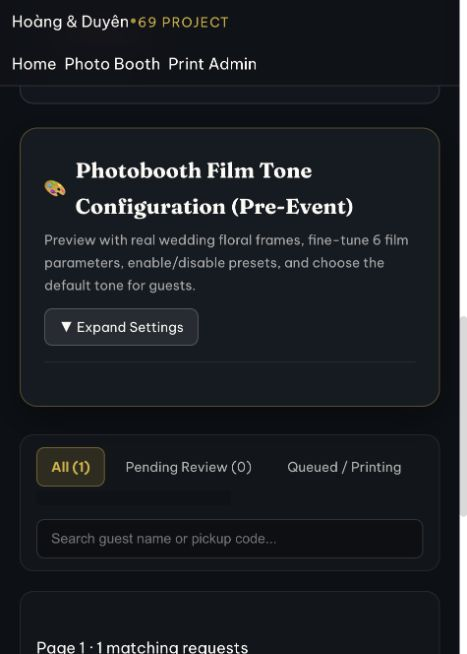

# Photo/printing: các sửa lỗi vận hành ngày 03/10/2026

Phạm vi theo yêu cầu: giữ nguyên authentication và kết nối/thiết lập máy in. Không đổi hardware flag, station token hay mật khẩu. Migration đã áp dụng trên Supabase production `uloouvqxfjaonldsjfir` ngày 03/10/2026. Source đang được triển khai qua nhánh main của Vercel `hoangle/wedding-site`.

## Hành vi đã sửa

- Film config không còn trả defaults hoặc báo save thành công khi RPC thiếu. Save phải persist thật; mỗi request tiếp tục pin config/snapshot. Release SQL bổ sung bảng, RPC và catalog còn thiếu, giữ lịch sử và settings operator.
- Status/session/dashboard đọc không khóa dòng print session. Trạng thái claim hết lease được chiếu thành review trong response; các mutation vẫn reconcile và khóa theo state machine cũ.
- Admission dùng lease trong PostgreSQL, tối đa 4 tác vụ ảnh đồng thời trên toàn deployment, 1.200 admissions/giờ. Lease 120 giây, handler timeout 60 giây, release trong finally; token cũ không giải phóng lease thay thế. Giới hạn upload cũ 400/giờ vẫn giữ nguyên.
- Guest/admin retry PROCESSING_BUSY bằng đúng payload, tối đa 12 lần với Retry-After và jitter. Network/5xx không tự submit lại; draft và operation key được giữ để retry có chủ đích. Request đã commit được lấy lại trước admission.
- Tracking chỉ một fetch đang chạy; backoff khi lỗi, pause khi tab ẩn, dừng ready/rejected/404 và có Refresh thủ công. Dashboard polling 10 giây, cùng cơ chế pause/backoff, fetch tuần tự.
- Dashboard phân trang 25 ảnh, tối đa 50 qua API; filter/search/counts trên server cho toàn queue. Signing theo batch 5, cache URL theo path trong mỗi instance trong 8 phút, dùng thumbnail 320px cho ảnh mới và ảnh được chỉnh. Ảnh cũ chưa có thumbnail vẫn mở bằng print gốc.
- Index bổ sung trên attempts.request_id và requests(status,created_at,id). URL cache là tối ưu hiệu năng cục bộ, không dùng làm admission toàn hệ thống.
- Admin replacement dùng cùng compressor <=3MiB với guest; server giới hạn cùng mức, giữ byte đã nén cho exact retry. HEIC >3MiB vẫn cần export JPEG như trước.
- Reload draft lấy preview mới qua upload ID/token còn hạn. Preview không được tái sử dụng từ URL cũ đã hết hạn. Upload hết hạn trả lỗi rõ ràng; draft đã gửi vẫn có thể retry để lấy request đã commit.
- API trả capacity/remaining thực từ DB, hỗ trợ unlimited và quota hữu hạn. Không ép UI thành unlimited khi backend vẫn có quota.
- HEIC đọc kích thước qua libheif trước cấp phát full RGBA buffer, chặn ảnh vượt 64MP, dispose decoder; dùng Sharp encode thay vì JPEG encoder JavaScript của heic-convert. Camera/HEIC trên điện thoại thật vẫn cần nghiệm thu riêng.

## Kiểm chứng

- `npm run test:photo`: 25 tests pass, gồm admission 100 callers chỉ cấp 4 leases, lease token/expiry, quota, dashboard pagination/filter, effective review read không sửa DB, missing film RPC, polling và idempotent release SQL.
- `npm run test:photo:api -- --load`: pass. 100 virtual users khởi đầu đồng thời; mỗi user upload JPEG 2.169.609 byte, render film, tạo request, retry cùng key và tracking. 100 request duy nhất, không lease còn treo. Lần chạy cuối 17.184ms; 1.647 admission rejections được retry trong fixture. Dashboard pagination truy xuất đủ 101 request (100 load + 1 fixture gốc).
- Cùng bài test kiểm tra private preview renewal, token sai, thumbnail <=320px, URL signing cache, config persistence, crop/filter validation, edit, approve, claim/report, ready/reprint. Không gửi lệnh tới CUPS thật.
- `npm run test:photo:api -- --intake-only`: pass; hardware gates giữ nguyên.
- Browser trên production build fixture: restore draft mở được preview và 12 presets; admin login mở queue, pagination và thumbnail. Chỉnh brightness Soft Wedding từ 20 → 19, save trả v5; reload giữ 19. Không có error/warn trong browser log.
- Lint: 0 errors, 20 warnings có sẵn. Build Next 16.3.8 pass.

HTTP harness mặc định gọi các exported route handlers thật qua một HTTP server với adapter PostgREST/Storage và PGlite. Nó không chạy compiler Next thứ hai; mode `--preview` build và chạy Next thật để kiểm tra UI/routes. Việc này khắc phục test cũ bị exit 137 và sửa assertion so bản in đã chỉnh với byte ảnh gốc.

Fixture PostgreSQL PGlite tuần tự hóa queries; số đo này kiểm chứng logic/concurrency admission/retry và xử lý ảnh local, **không phải benchmark Vercel/Supabase production hay Postgres nhiều connections**. Chưa xác minh plan/memory/region/telemetry cloud. Không kết luận đã bảo đảm production cho 100 người chỉ từ fixture.

## Thứ tự đưa lên production

1. Xác minh đúng Supabase project và Vercel project `hoangle/wedding-site` phục vụ `www.project69hd.xyz`.
2. Chạy `node tools/photo-print/prepare-release.mjs` để tạo `docs/photo-runtime-release.sql`. File gom đúng thứ tự bằng một transaction, dùng guards để upgrade queue đang có hoặc schema trống; có thể chạy lại mà không seed lại film hoặc thay settings đã lưu. Không chạy migration legacy `20261002_photo_admin_edit.sql` sau safe wrapper.
3. Apply file SQL bằng tài khoản có quyền SQL trên đúng Supabase. Đợi PostgREST reload schema. Không dùng service-role REST key như credential chạy DDL.
4. Deploy source tương ứng sau SQL. Không deploy API mới trước runtime RPC/thumbnail schema; thiếu schema trả 503 thay vì báo thành công giả.
5. Verify production save → reload → guest config → request snapshot, preview renewal, pagination và một đợt mixed traffic trên staging cùng cấu hình cloud. Giữ hardware flag như hiện tại cho đến khi nghiệm thu máy in theo phạm vi riêng.

Production SQL đã apply qua SQL Editor trong một transaction, trả Success. REST kiểm chứng runtime read_session/dashboard và film RPC hoạt động: capacity null, reserved 4, accepting true, preset version 3. Vercel dùng Git integration; CLI management credential cũ trả 403 nhưng dashboard đã xác minh đúng project/repository và main production branch. Không tự xóa ảnh cũ hoặc thay chính sách retention; file chưa xác định commit vẫn được giữ để tránh xóa ảnh của request đã lưu.
